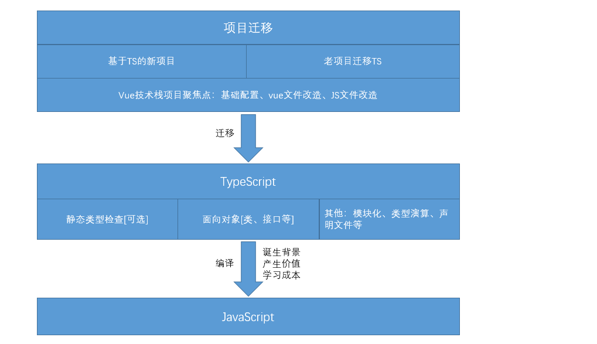

## typeScript
> 背景：前端领域技术发展迅速，JS语言原罪也在逐步显露[弱类型、无模块化，不擅长大型工程项目]，ECMA官方组织也意识到了该问题，JS版本迭代很快，主要方向就是语法更严格 && 面向对象思想，但JS终究是弱类型语言，很多底层东西也无法'改动'，还有部分原因就是虽然当年微软干掉了网景，但JS的设计权也没有拿到，最终归属到了ECMA组织，微软一直都想取代js，但显然不可能做到，于是推出了ts，ts的影响力与日俱增 => TS诞生了，其是JS类型的超集，TS = 可选静态类型检查[向强类型语言迈进] + 增强面向对象编程[接口、泛型概念]
> 本质：根据TS语法规则书写代码 -> TS编译器进行编译 -> 生成目标代码JS，后续就与TS无关了;//实际TS是可选的，也就是使用部分TS语法书写也是OK的，其进行编译转换为目标代码，即使代码有错，其也不会理会[除非涉及到编译阶段的报错]，底层实现原理就是'抽象语法树 -> 替换 -> 生成目标代码'//TS迭代同JS基本保持同步：TS官方宣布其会与JS语法保持同步，只要JS实现的语法，TS会尽快支持，这样开发者可以尽情使用最新的JS语法，'编译层'TS掌握很大主动权

### 优势 && 应用场景
> 优势：强约束的语法结构会提升开发效率，而且维护也更容易[开发时语法就很严格，后续维护当然容易]
> 应用场景：Node端应用[TS应用于Node，可让Node开发更加面向对象]、大型JS游戏引擎、前端大型库[例如Vue/React]等，实际小型项目没必要'强用TS'，大型项目使用TS才能真正发挥其的优势，初期学习TS感觉很'鸡肋'，没什么用处，而且面向对象的语法还比较难，但是这些思想很重要，对于工程化项目，以及看一些前端库的源码很有帮助[Vue3源码基于TS]

> 

> 目录参考

背景

未来发展

能力提供

可选的静态类型检查 + 类型推断
面向对象编程
编译成目标js代码[es3,es5,es6等]、有错误是否可提交[默认是可提交的]

tsconfig.json -> 这里的json可以写注释，其它json并不能写
tsc
tsc -w

tsconfig.json > shell > 默认项

// ts能做的转换仅仅是：语言糖层面的转换，有些新语法并不能实现，babel可以，其是模拟实现
// npm i -D @babel/core @babel/preset-env babel-loader core-js
// core-js提供js环境，老版本浏览器js在该环境下运行来实现好点的兼容性

// ts会检查不同文件中变量的重复，不能出现重复，或者使用立即执行函数实现模块化
